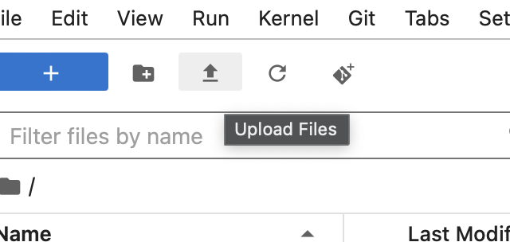

# PyHC Summer School 24 Jupyter Lab

*[HelioCloud](http://heliocloud.org) at home!*

The [2024 PyHC Summer School](https://heliopython.org/summer-school-24) interactive notebooks were ran on HelioCloud using an image provided with all of the required dependencies.

This repository contains a Docker file that is based on that image and also installs/runs jupyter lab so you can run the same notebooks without access to HelioCloud!

## Dependencies
- [Docker](https://www.docker.com)

## Building/Running Jupyter Lab locally

``` shell
docker build -t pyhc-notebook .
docker run -p 8888:8888 -v $(pwd)/jupyter-lab/:/notebook/ pyhc-notebook
```

The output of running the container will contain a URL for you to hit. It will look something like this:
```
To access the server, open this file in a browser:
        file:///home/jovyan/.local/share/jupyter/runtime/jpserver-1-open.html # This isn't real, it won't hurt you.
    Or copy and paste one of these URLs:
        http://abcdefg:8888/lab?token=NOT_A_REAL_TOKEN # Don't use this one
     or http://127.0.0.1:8888/lab?token=NOT_A_REAL_TOKEN # <----- Use this one!!
```

## File location

The argument, `-v $(pwd):/notebook/`, is passed to docker, which mounts the home directory in Jupyter Lab to folder where you started the container. This will ensure that any edits made in Jupyter Lab will be saved to your machine.

## Tutorial Notebooks

### Fresh Notebooks

If you want to access the notebooks used for the summer school, see [summer-school-24](https://github.com/heliophysicsPy/summer-school-24.git).

### Existing Notebooks

If you downloaded your notebooks from the summer school, you can upload them via:


()


## Running the Notebooks

**Jupyter lab is running on your machine - all data downloaded will be stored on your machine, notebooks will use your memory.**

### Data Sources

Some of the notebooks used in the summer school pulled data from locally (in HelioCloud). **These notebooks will not work when ran locally** unless you configure the notebooks to download the data or point to a source on your machine.

